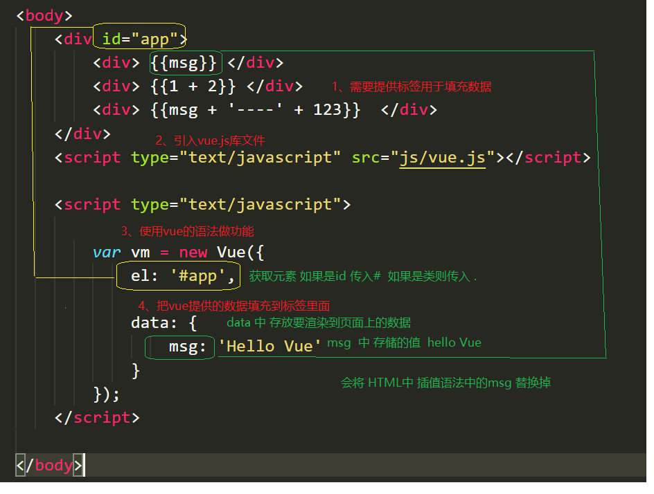
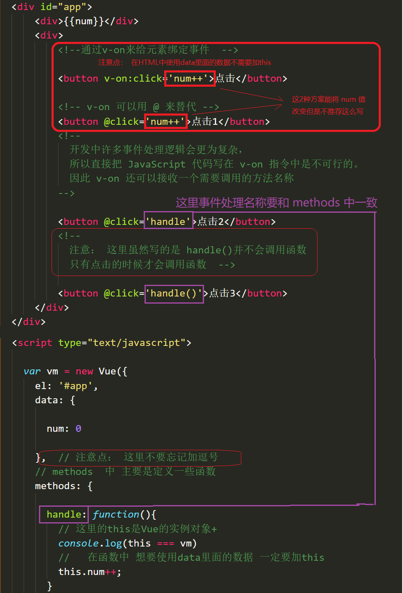

# day01

### Vue 是什么？

- **Vue (读音 /vjuː/，类似于 **view**) 是一套用于构建用户界面的渐进式框架**
- vue 的核心库只关注视图层，不仅易于上手，还便于与第三方库或既有项目整合

### 使用Vue将helloworld  渲染到页面上 



###  指令

- 本质就是自定义属性
- Vue中指定都是以 v- 开头 

###  v-cloak

- 防止页面加载时出现闪烁问题

  ```html
   <style type="text/css">
    /* 
      1、通过属性选择器 选择到 带有属性 v-cloak的标签  让他隐藏
   */
    [v-cloak]{
      /* 元素隐藏    */
      display: none;
    }
    </style>
  <body>
    <div id="app">
      <!-- 2、 让带有插值 语法的   添加 v-cloak 属性 
           在 数据渲染完场之后，v-cloak 属性会被自动去除，
           v-cloak一旦移除也就是没有这个属性了  属性选择器就选择不到该标签
  		 也就是对应的标签会变为可见
      -->
      <div  v-cloak  >{{msg}}</div>
    </div>
    <script type="text/javascript" src="js/vue.js"></script>
    <script type="text/javascript">
      var vm = new Vue({
        //  el   指定元素 id 是 app 的元素  
        el: '#app',
        //  data  里面存储的是数据
        data: {
          msg: 'Hello Vue'
        }
      });
  </script>
  </body>
  </html>
  ```
  

###  v-text

- v-text指令用于将数据填充到标签中，作用于插值表达式类似，但是没有闪动问题
- 如果数据中有HTML标签会将html标签一并输出
- 注意：此处为单向绑定，数据对象上的值改变，插值会发生变化；但是当插值发生变化并不会影响数据对象的值

```html
<div id="app">
    <!--  
		注意:在指令中不要写插值语法  直接写对应的变量名称 
        在 v-text 中 赋值的时候不要在写 插值语法
		一般属性中不加 {{}}  直接写 对应 的数据名 
	-->
    <p v-text="msg"></p>
    <p>
        <!-- Vue  中只有在标签的 内容中 才用插值语法 -->
        {{msg}}
    </p>
</div>

<script>
    new Vue({
        el: '#app',
        data: {
            msg: 'Hello Vue.js'
        }
    });

</script>
```

###  v-html

- 用法和v-text 相似  但是他可以将HTML片段填充到标签中

- 可能有安全问题, 一般只在可信任内容上使用 `v-html`，**永不**用在用户提交的内容上

- 它与v-text区别在于v-text输出的是纯文本，浏览器不会对其再进行html解析，但v-html会将其当html标签解析后输出。

  ```html
  <div id="app">
  　　<p v-html="html"></p> <!-- 输出：html标签在渲染的时候被解析 -->
      
      <p>{{message}}</p> <!-- 输出：<span>通过双括号绑定</span> -->
      
  　　<p v-text="text"></p> <!-- 输出：<span>html标签在渲染的时候被源码输出</span> -->
  </div>
  <script>
  　　let app = new Vue({
  　　el: "#app",
  　　data: {
  　　　　message: "<span>通过双括号绑定</span>",
  　　　　html: "<span>html标签在渲染的时候被解析</span>",
  　　　　text: "<span>html标签在渲染的时候被源码输出</span>",
  　　}
   });
  </script>
  ```

###  v-pre

- 显示原始信息跳过编译过程
- 跳过这个元素和它的子元素的编译过程。
- **一些静态的内容不需要编译加这个指令可以加快渲染**

```html
    <span v-pre>{{ this will not be compiled }}</span>    
	<!--  显示的是{{ this will not be compiled }}  -->
	<span v-pre>{{msg}}</span>  
     <!--   即使data里面定义了msg这里仍然是显示的{{msg}}  -->
<script>
    new Vue({
        el: '#app',
        data: {
            msg: 'Hello Vue.js'
        }
    });

</script>
```

### **v-once**

- 执行一次性的插值【当数据改变时，插值处的内容不会继续更新】

```html
  <!-- 即使data里面定义了msg 后期我们修改了 仍然显示的是第一次data里面存储的数据即 Hello Vue.js  -->
     <span v-once>{{ msg}}</span>    
<script>
    new Vue({
        el: '#app',
        data: {
            msg: 'Hello Vue.js'
        }
    });
</script>
```


### 双向数据绑定

- 当数据发生变化的时候，视图也就发生变化
- 当视图发生变化的时候，数据也会跟着同步变化

#### v-model

- **v-model**是一个指令，限制在 `<input>、<select>、<textarea>、components`中使用

```html
 <div id="app">
      <div>{{msg}}</div>
      <div>
          当输入框中内容改变的时候，  页面上的msg  会自动更新
        <input type="text" v-model='msg'>
      </div>
  </div>
```

### mvvm

- MVC 是后端的分层开发概念； MVVM是前端视图层的概念，主要关注于 视图层分离，也就是说：MVVM把前端的视图层，分为了 三部分 Model, View , VM ViewModel
- m   model  
  - 数据层   Vue  中 数据层 都放在 data 里面
- v   view     视图   
  - Vue  中  view      即 我们的HTML页面  
- vm   （view-model）     控制器     将数据和视图层建立联系      
  - vm 即  Vue 的实例  就是 vm  

###   v-on

- 用来绑定事件的
-  形式如：v-on:click  缩写为 @click;



###  v-on事件函数中传入参数

```html

<body>
    <div id="app">
        <div>{{num}}</div>
        <div>
            <!-- 如果事件直接绑定函数名称，那么默认会传递事件对象作为事件函数的第一个参数 -->
            <button v-on:click='handle1'>点击1</button>
            <!-- 2、如果事件绑定函数调用，那么事件对象必须作为最后一个参数显示传递，
                 并且事件对象的名称必须是$event 
            -->
            <button v-on:click='handle2(123, 456, $event)'>点击2</button>
        </div>
    </div>
    <script type="text/javascript" src="js/vue.js"></script>
    <script type="text/javascript">
        var vm = new Vue({
            el: '#app',
            data: {
                num: 0
            },
            methods: {
                handle1: function(event) {
                    console.log(event.target.innerHTML)
                },
                handle2: function(p, p1, event) {
                    console.log(p, p1)
                    console.log(event.target.innerHTML)
                    this.num++;
                }
            }
        });
    </script>
```

###  事件修饰符

- 在事件处理程序中调用 `event.preventDefault()` 或 `event.stopPropagation()` 是非常常见的需求。
- Vue 不推荐我们操作DOM    为了解决这个问题，Vue.js 为 `v-on` 提供了**事件修饰符**
- 修饰符是由点开头的指令后缀来表示的

```html
<!-- 阻止单击事件继续传播 -->
<a v-on:click.stop="doThis"></a>

<!-- 提交事件不再重载页面 -->
<form v-on:submit.prevent="onSubmit"></form>

<!-- 修饰符可以串联   即阻止冒泡也阻止默认事件 -->
<a v-on:click.stop.prevent="doThat"></a>

<!-- 只当在 event.target 是当前元素自身时触发处理函数 -->
<!-- 即事件不是从内部元素触发的 -->
<div v-on:click.self="doThat">...</div>

使用修饰符时，顺序很重要；相应的代码会以同样的顺序产生。因此，用 v-on:click.prevent.self 会阻止所有的点击，而 v-on:click.self.prevent 只会阻止对元素自身的点击。
```

### 按键修饰符

- 在做项目中有时会用到键盘事件，在监听键盘事件时，我们经常需要检查详细的按键。Vue 允许为 `v-on` 在监听键盘事件时添加按键修饰符

```html
<!-- 只有在 `keyCode` 是 13 时调用 `vm.submit()` -->
<input v-on:keyup.13="submit">

<!-- -当点击enter 时调用 `vm.submit()` -->
<input v-on:keyup.enter="submit">

<!--当点击enter或者space时  时调用 `vm.alertMe()`   -->
<input type="text" v-on:keyup.enter.space="alertMe" >

常用的按键修饰符
.enter =>    enter键
.tab => tab键
.delete (捕获“删除”和“退格”按键) =>  删除键
.esc => 取消键
.space =>  空格键
.up =>  上
.down =>  下
.left =>  左
.right =>  右

<script>
	var vm = new Vue({
        el:"#app",
        methods: {
              submit:function(){},
              alertMe:function(){},
        }
    })

</script>
```

### 自定义按键修饰符别名

- 在Vue中可以通过`config.keyCodes`自定义按键修饰符别名

```html
<div id="app">
    预先定义了keycode 116（即F5）的别名为f5，因此在文字输入框中按下F5，会触发prompt方法
    <input type="text" v-on:keydown.f5="prompt()">
</div>

<script>
	
    Vue.config.keyCodes.f5 = 116;

    let app = new Vue({
        el: '#app',
        methods: {
            prompt: function() {
                alert('我是 F5！');
            }
        }
    });
</script>
```

### v-bind

- v-bind 指令被用来响应地更新 HTML 属性
- v-bind:href    可以缩写为    :href;

```html
<!-- 绑定一个属性 -->


<!-- 缩写 -->

```

#### 绑定对象

- 我们可以给v-bind:class 一个对象，以动态地切换class。
- 注意：v-bind:class指令可以与普通的class特性共存

```html
1、 v-bind 中支持绑定一个对象 
	如果绑定的是一个对象 则 键为 对应的类名  值 为对应data中的数据 
<!-- 
	HTML最终渲染为 <ul class="box textColor textSize"></ul>
	注意：
		textColor，textSize  对应的渲染到页面上的CSS类名	
		isColor，isSize  对应vue data中的数据  如果为true 则对应的类名 渲染到页面上 


		当 isColor 和 isSize 变化时，class列表将相应的更新，
		例如，将isSize改成false，
		class列表将变为 <ul class="box textColor"></ul>
-->

<ul class="box" v-bind:class="{textColor:isColor, textSize:isSize}">
    <li>学习Vue</li>
    <li>学习Node</li>
    <li>学习React</li>
</ul>
  <div v-bind:style="{color:activeColor,fontSize:activeSize}">对象语法</div>

<sript>
var vm= new Vue({
    el:'.box',
    data:{
        isColor:true,
        isSize:true，
    	activeColor:"red",
        activeSize:"25px",
    }
})
</sript>
<style>

    .box{
        border:1px dashed #f0f;
    }
    .textColor{
        color:#f00;
        background-color:#eef;
    }
    .textSize{
        font-size:30px;
        font-weight:bold;
    }
</style>
```

####  绑定class

```html
2、  v-bind 中支持绑定一个数组    数组中classA和 classB 对应为data中的数据

这里的classA  对用data 中的  classA
这里的classB  对用data 中的  classB
<ul class="box" :class="[classA, classB]">
    <li>学习Vue</li>
    <li>学习Node</li>
    <li>学习React</li>
</ul>
<script>
var vm= new Vue({
    el:'.box',
    data:{
        classA:‘textColor‘,
        classB:‘textSize‘
    }
})
</script>
<style>
    .box{
        border:1px dashed #f0f;
    }
    .textColor{
        color:#f00;
        background-color:#eef;
    }
    .textSize{
        font-size:30px;
        font-weight:bold;
    }
</style>
```

#### 绑定对象和绑定数组 的区别

- 绑定对象的时候 对象的属性 即要渲染的类名 对象的属性值对应的是 data 中的数据 
- 绑定数组的时候数组里面存的是data 中的数据 

#### 绑定style

```html
 <div v-bind:style="styleObject">绑定样式对象</div>'
 
<!-- CSS 属性名可以用驼峰式 (camelCase) 或短横线分隔 (kebab-case，记得用单引号括起来)    -->
 <div v-bind:style="{ color: activeColor, fontSize: fontSize,background:'red' }">内联样式</div>

<!--组语法可以将多个样式对象应用到同一个元素 -->
<div v-bind:style="[styleObj1, styleObj2]"></div>


<script>
	new Vue({
      el: '#app',
      data: {
        styleObject: {
          color: 'green',
          fontSize: '30px',
          background:'red'
        }，
        activeColor: 'green',
   		fontSize: "30px"
      },
      styleObj1: {
             color: 'red'
       },
       styleObj2: {
            fontSize: '30px'
       }

</script>
```

### 分支结构

#### v-if 使用场景

- 1- 多个元素 通过条件判断展示或者隐藏某个元素。或者多个元素
- 2- 进行两个视图之间的切换

```html
<div id="app">
        <!--  判断是否加载，如果为真，就加载，否则不加载-->
        <span v-if="flag">
           如果flag为true则显示,false不显示!
        </span>
</div>

<script>
    var vm = new Vue({
        el:"#app",
        data:{
            flag:true
        }
    })
</script>

----------------------------------------------------------

    <div v-if="type === 'A'">
       A
    </div>
  <!-- v-else-if紧跟在v-if或v-else-if之后   表示v-if条件不成立时执行-->
    <div v-else-if="type === 'B'">
       B
    </div>
    <div v-else-if="type === 'C'">
       C
    </div>
  <!-- v-else紧跟在v-if或v-else-if之后-->
    <div v-else>
       Not A/B/C
    </div>

<script>
    new Vue({
      el: '#app',
      data: {
        type: 'C'
      }
    })
</script>
```

#### v-show 和 v-if的区别

- v-show本质就是标签display设置为none，控制隐藏
  - v-show只编译一次，后面其实就是控制css，而v-if不停的销毁和创建，故v-show性能更好一点。
- v-if是动态的向DOM树内添加或者删除DOM元素
  - v-if切换有一个局部编译/卸载的过程，切换过程中合适地销毁和重建内部的事件监听和子组件

### 循环结构

#### v-for

- 用于循环的数组里面的值可以是对象，也可以是普通元素  

```html
<ul id="example-1">
   <!-- 循环结构-遍历数组  
	item 是我们自己定义的一个名字  代表数组里面的每一项  
	items对应的是 data中的数组-->
  <li v-for="item in items">
    {{ item.message }}
  </li> 

</ul>
<script>
 new Vue({
  el: '#example-1',
  data: {
    items: [
      { message: 'Foo' },
      { message: 'Bar' }
    ]，
   
  }
})
</script>
```

- **不推荐**同时使用 `v-if` 和 `v-for`
- 当 `v-if` 与 `v-for` 一起使用时，`v-for` 具有比 `v-if` 更高的优先级。

```html
   <!--  循环结构-遍历对象
		v 代表   对象的value
		k  代表对象的 键 
		i  代表索引	
	---> 
     <div v-if='v==13' v-for='(v,k,i) in obj'>{{v + '---' + k + '---' + i}}</div>

<script>
 new Vue({
  el: '#example-1',
  data: {
    items: [
      { message: 'Foo' },
      { message: 'Bar' }
    ]，
    obj: {
        uname: 'zhangsan',
        age: 13,
        gender: 'female'
    }
  }
})
</script>
```

- key 的作用
  - **key来给每个节点做一个唯一标识**
  - **key的作用主要是为了高效的更新虚拟DOM**

```html
<ul>
  <li v-for="item in items" :key="item.id">...</li>
</ul>

```


### 案例选项卡

#### 1、 HTML 结构

```html
`
    <div id="app">
        <div class="tab">
            <!--  tab栏  -->
            <ul>
                <li class="active">apple</li>
                <li class="">orange</li>
                <li class="">lemon</li>
            </ul>
              <!--  对应显示的图片 -->
            <div class="current"></div>
            <div class=""></div>
            <div class=""></div>
        </div>
    </div>


`
```

#### 2、 提供的数据

```js
         list: [{
                    id: 1,
                    title: 'apple',
                    path: 'img/apple.png'
                }, {
                    id: 2,
                    title: 'orange',
                    path: 'img/orange.png'
                }, {
                    id: 3,
                    title: 'lemon',
                    path: 'img/lemon.png'
                }]
```


#### 3、 把数据渲染到页面

- 把tab栏 中的数替换到页面上

  - 把 data 中 title  利用 v-for 循环渲染到页面上 
  - 把 data 中 path利用 v-for 循环渲染到页面上 

  ```html
      <div id="app">
          <div class="tab">  
              <ul>
                    <!--  
                      1、绑定key的作用 提高Vue的性能 
                      2、 key 需要是唯一的标识 所以需要使用id， 也可以使用index ，
  						index 也是唯一的 
                      3、 item 是 数组中对应的每一项  
                      4、 index 是 每一项的 索引
                  -->
                     <li :key='item.id' v-for='(item,index) in list'>{{item.title}}</li>
                </ul>
                <div  :key='item.id' v-for='(item, index) in list'>
                      <!-- :  是 v-bind 的简写   绑定属性使用 v-bind -->
                      
                </div>
          </div>
      </div>
  <script>
      new  Vue({
          //  指定 操作元素 是 id 为app 的 
          el: '#app',
              data: {
                  list: [{
                      id: 1,
                      title: 'apple',
                      path: 'img/apple.png'
                  }, {
                      id: 2,
                      title: 'orange',
                      path: 'img/orange.png'
                  }, {
                      id: 3,
                      title: 'lemon',
                      path: 'img/lemon.png'
                  }]
              }
      })
  
  </script>
  ```

  

#### 4、 给每一个tab栏添加事件,并让选中的高亮

- 4.1 、让默认的第一项tab栏高亮

  - tab栏高亮 通过添加类名active 来实现   （CSS  active 的样式已经提前写好）
    - 在data 中定义一个 默认的  索引 currentIndex  为  0 
    - 给第一个li 添加 active 的类名  
      - 通过动态绑定class 来实现   第一个li 的索引为 0     和 currentIndex   的值刚好相等
      -  currentIndex     ===  index  如果相等  则添加类名 active  否则 添加 空类名

- 4.2 、让默认的第一项tab栏对应的div 显示 

  - 实现思路 和 第一个 tab 实现思路一样  只不过 这里控制第一个div 显示的类名是 current

  ```html
    <ul>
  	   <!-- 动态绑定class   有 active   类名高亮  无 active   不高亮-->
         <li  :class='currentIndex==index?"active":""'
             :key='item.id' v-for='(item,index) in list'
             >{{item.title}}</li>
    </ul>
  	<!-- 动态绑定class   有 current  类名显示  无 current  隐藏-->
    <div :class='currentIndex==index?"current":""' 
         
         :key='item.id' v-for='(item, index) in list'>
          <!-- :  是 v-bind 的简写   绑定属性使用 v-bind -->
          
    </div>
  
  <script>
      new  Vue({
          el: '#app',
              data: {
                  currentIndex: 0, // 选项卡当前的索引  默认为 0  
                  list: [{
                      id: 1,
                      title: 'apple',
                      path: 'img/apple.png'
                  }, {
                      id: 2,
                      title: 'orange',
                      path: 'img/orange.png'
                  }, {
                      id: 3,
                      title: 'lemon',
                      path: 'img/lemon.png'
                  }]
              }
      })
  
  </script>
  ```

- 4.3 、点击每一个tab栏 当前的高亮 其他的取消高亮 

  - 给每一个li添加点击事件    

  - 让当前的索引 index  和  当前 currentIndex 的  值 进项比较 

  - 如果相等 则当前li  添加active 类名 当前的 li 高亮  当前对应索引的 div 添加 current 当前div 显示 其他隐藏

    ```html
        <div id="app">
            <div class="tab">
                <ul>
                    <!--  通过v-on 添加点击事件   需要把当前li 的索引传过去 
    				-->
                    <li v-on:click='change(index)'		           			
                        :class='currentIndex==index?"active":""'                   
                        :key='item.id' 
                        v-for='(item,index) in list'>{{item.title}}</li>
                </ul>
                <div :class='currentIndex==index?"current":""' 
                     :key='item.id' v-for='(item, index) in list'>
                    
                </div>
            </div>
        </div>
    
    <script>
        new  Vue({
            el: '#app',
                data: {
                    currentIndex: 0, // 选项卡当前的索引  默认为 0  
                    list: [{
                        id: 1,
                        title: 'apple',
                        path: 'img/apple.png'
                    }, {
                        id: 2,
                        title: 'orange',
                        path: 'img/orange.png'
                    }, {
                        id: 3,
                        title: 'lemon',
                        path: 'img/lemon.png'
                    }]
                },
                methods: {
                    change: function(index) {
                        // 通过传入过来的索引来让当前的  currentIndex  和点击的index 值 相等 
                        //  从而实现 控制类名    
                        this.currentIndex = index;
                    }
                }
        
        })
    
    </script>
    ```

    